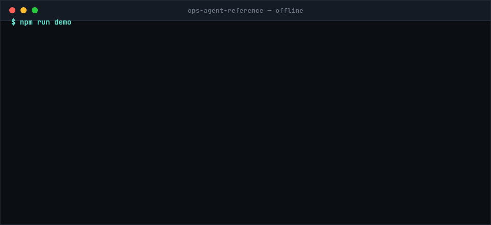

# ops-agent-reference

A production ops-agent pipeline: meeting transcripts, channel logs, GitHub activity, email threads
and document activity in — governed tracker writes out, with human-in-the-loop gates on everything
it is not sure about.

**Not a product. Not a maintained service. A reference that runs.** There is no support channel and
no compatibility promise; the point is that you can read it, run it offline, and take the parts that
are useful.



*Real captured output, replayed at reading speed — the actual run takes ~40ms. Nothing above is staged.*

```bash
npm ci
npm run demo             # 8 scenarios, offline, ~40ms, no API key
npm run demo -- --twice  # a redelivery costs zero tokens
```

From real trace data across 49 production runs — 48 meetings and one channel log — totalling 711
items: **14.5 items per run, 62.6% applied automatically, 27.3% held for a human, 8.2% skipped as a
duplicate, 2.0% failed.** It runs for a team of 12, which is the roster size in the routing registry
that governs it.

Those four dispositions partition every item — 445 + 194 + 58 + 14 = 711, so a fifth outcome would
show up as a gap. (The rounded percentages sum to 100.1; the counts are the claim.)

*Applied* counts everything the pipeline did without a human: creates, status changes and comments.
Creates alone are 44.4%.

**One hold does not mean "unsure" at all.** The `critical` gate holds a write that touches
credentials, client PII, a production deploy or a client-facing send **even when every other gate
passed** — and its patterns are compiled constants no env var, correction, prompt or model output
can reach. See [ARCHITECTURE.md](ARCHITECTURE.md).

**That 27.3% is the number to look at.** A pipeline that writes to a real board is only useful if it
knows what it does not know, and better than a quarter of everything it sees goes to a human instead
of to the board. The gates that decide which quarter are the substance of this repo.

**No precision or recall is claimed, here or anywhere.** That needs a hand-labelled ground truth that
does not exist, and the only alternative — a model grading a model — is a system agreeing with
itself. Volume and hold rate are honest; accuracy is not reported. See
[LIMITATIONS.md](LIMITATIONS.md).

It is extracted from a system that has been running in production. **The architecture is identical to
what we run; the tuned few-shot examples are replaced with generic ones.**
[EXTRACTION.md](EXTRACTION.md) records exactly what changed on the way out and why.

### What this is one half of

The production system runs **two paths over one writer**, and they are matched to two different
shapes of input:

| | Agent path | This repo |
|---|---|---|
| Input | one conversational request, ambiguous, a human present | 6–14 items, uniform policy, nobody watching |
| Decides by | a model, over a long tool-using loop | deterministic code, in passes 2a/2b |
| Reaches the tracker via | the same single writer | the same single writer |

**This repo is the second path**, and it is the one worth publishing: an agent is good at one
ambiguous request with a human on the other end, and bad at applying consistent policy to fourteen
items unattended. A pipeline is the reverse.

The agent path itself is **not here**, and could not be — production delegates that loop to a
separate runtime whose prompts read internal workspace files by name, and those names are exactly
what this repo's CI guard blocks. What *is* here is an agent layer written for this repo, off by
default, described in [AGENTS.md](AGENTS.md).

## The shape

```
source (transcript | channel | github | gmail | drive)
  └─ Pass 0    cleanup
     Pass 1    inventory        ─ what was actually asked for
     Pass 1.5  critic           ─ what the inventory got wrong
     Pass 1.7  consolidator     ─ merge, dedupe, anchor
     Pass 2a   categorization   ─ NEW_TASK | DUPLICATE | SUBTASK | UPDATE, against the live board
     Pass 2b   contract check   ─ a BLIND re-derivation; new-vs-existing disagreement holds
     Pass 2c   execute          ─ the only writer. Deterministic. No model in the write path.
     Pass 2d   audit            ─ did the board end up how 2c said it would?
```

**Pass 2b never sees Pass 2a's answer.** That is the headline claim, and it has a test that fails
loudly if someone "helpfully" passes the manifest item in. Two independent reads that agree are
evidence; a second read shown the first answer is a rubber stamp.

## Running it

Nothing here needs an API key. The demo replays recorded model responses through the real prompts,
the real parsers and the real gates:

```bash
npm ci
npm run demo                           # all eight scenarios, offline, ~40ms
npm run demo -- --twice                # proves a redelivery costs zero tokens
npm run demo -- --provider anthropic   # the same scenarios, replayed from a Claude recording
npm run demo -- --agents               # with the agent layer on (PRD §5), also offline
```

```
▶ 01-meeting-mixed — A normal standup: four categories exercised, four cards created, one duplicate
  skipped, and a post-write audit that confirms the board matches the plan.
  ✓ 0-cleanup            1ms
  ✓ 1-inventory          1ms
  ✓ 1.5-critic           0ms
  ✓ 1.7-consolidator     1ms
  ✓ evidence             2ms
  ✓ 2a-categorization    10ms
[pass2b] item 5: existing-card dispute (2a=SUBTASK vs blind=UPDATE) — trusting 2a, not holding
  ✓ 2b-contract-check    8ms
  ✓ 2c-execute           1ms
  → 4 created · 1 commented · 1 skipped · 0 failed
  ✓ 2d-audit             1ms
  ✓ audit: 6 passed, 0 mismatched
  ✓ 6 items · 4 created · 0 held · 0 skipped — matches expected.json
```

The replayed replies are real: recorded from `deepseek-v4-pro` against these exact prompts. A missing
cassette is a loud error, never an empty reply — an empty reply is indistinguishable from a pass that
legitimately found nothing, which would make the demo go green having done nothing at all.

Both providers have been run live across all eight scenarios and both recordings ship. They agree on
three and disagree on five — and **every disagreement is at Pass 1, the extraction**, never in a gate,
a plan or a write. See [PROVIDERS.md](PROVIDERS.md) for the measured cost and the pattern in where
they part company.

## The eight scenarios

| | What it demonstrates |
|---|---|
| `01-meeting-mixed` | A normal standup. Four categories exercised, four cards created, one duplicate skipped. |
| `02-meeting-duplicates` | Both deliverables already on the board under different wording. **The run writes nothing at all.** |
| `03-meeting-noise` | Pure discussion. Nothing is extracted — the pipeline does not invent work to look useful. |
| `04-channel-messages` | A channel log through the identical 1 → 2d chain. |
| `05-corrections` | A recorded human correction changes a later run — no duplicate hold on work a human already said is separate. |
| `06-github-activity` | Merged PRs, a commit and a new issue. **Two of four items hold**, because a code feed says who wrote a change and never who owns the follow-up. |
| `07-email-thread` | A thread with quoted reply chains stripped before Pass 1 sees them, and a "going forward we should always" line excluded as a norm. |
| `08-drive-activity` | Seven raw events — three contentless edits, a typo fix, a compliment — become four items and two cards. |

The last three are why the source seam is a seam: **the same 1 → 2d chain, no pass that branches on
which source produced the text.**

**What they do and do not pin.** They pin what deterministic code does with a given set of replies:
the parsers, the gates, the plan, the writes, the audit, the idempotency layers. They cannot pin
*which* reply a model returns.

Holds are the case worth being precise about. A hold that rests on a **judgement** — two independent
reads disagreeing about an ambiguous item — varies between recordings of the identical fixture, so no
scenario asserts one. A hold that rests on a **missing field** does not vary that way, and
`06-github-activity` asserts two of them. The gates themselves are proven separately and
deterministically, with scripted replies, in `contractGates.test.ts` and `run.test.ts`.

## The five seams

Everything is injected. Each seam exists because there was a real second implementation to write.

| Seam | Ships | |
|---|---|---|
| `ModelClient` | `deepseek` · `anthropic` · `cassette` | [PROVIDERS.md](PROVIDERS.md) |
| `TrackerAdapter` | `memory` · `clickup` · `linear` | [ADAPTERS.md](ADAPTERS.md) |
| `IdempotencyStore` | `memory` · `jsonFile` | three layers: event, source, content |
| `IngestSource` | `transcript` · `channel` · `github` · `gmail` · `drive` | payload → `IngestedSource`, pure |
| `SourceClient` | `github` · `gmail` · `drive` | reads a service. **No write method exists** |

**Reading a service and normalizing its payload are separate seams on purpose.** Every fixture in
this repo is a raw payload, so the entire pipeline is testable with no network and no credential —
the client is the only thing that ever needs one. Slack has no client of its own because a team-chat
log *is* the `channel` source; a fifth kind that rendered identically would be a name, not a
capability.

**Transport is still your problem.** Webhooks, polling schedules, cron, OAuth refresh and the queue
that hands a payload to `runPipeline` are not here, and every team's are different.

**One command joins the two seams end to end**, so "this repo reads GitHub" is something you can run
rather than something you read:

```bash
npm run pull -- --source github --repo owner/name --since 2026-08-01
npm run pull -- --source gmail --thread <threadId>
npm run pull -- --source drive --file <fileId> --write   # --write, or it only plans
```

This is the **only** path that needs credentials, and it plans without writing unless you ask. Every
fixture, test and demo stays offline because they start from a recorded payload rather than a live
read.

**An optional agent layer** (PRD §5) sits between the gates and the writer: a board agent that
delegates to eight role agents with **read-only** tools. It is off by default. It may **propose** a
different category, list, assignee or description — and every proposal is re-run through the same
gates, so one the gates refuse becomes a hold rather than a write. **The agent never writes, and
never un-holds.** See [AGENTS.md](AGENTS.md).

**The rule that makes the tracker seam real:** the pipeline speaks canonical member names and list
keys; only an adapter ever sees a tracker id. Every gate, prompt, parser and the whole categorization
taxonomy is tracker-blind because of it.

## Documentation

| | |
|---|---|
| [ARCHITECTURE.md](ARCHITECTURE.md) | The passes, the seams, idempotency, fail-open vs fail-closed |
| [LIMITATIONS.md](LIMITATIONS.md) | **What this cannot tell you.** Read before trusting a green run |
| [EXTRACTION.md](EXTRACTION.md) | What differs from production, what was de-tuned, and how it was checked |
| [ADAPTERS.md](ADAPTERS.md) | The tracker contract, the capability matrix, writing a fourth |
| [PROVIDERS.md](PROVIDERS.md) | Measured cost, and where DeepSeek and Claude disagree |
| [ROLES.md](ROLES.md) | The eight role archetypes and how they reach the prompt |
| [AGENTS.md](AGENTS.md) | The optional agent layer — what it may touch, and the two structural guarantees |
| [EVAL.md](EVAL.md) | Six dimensions, and why no accuracy figures are published |

## Development

```bash
npm run board         # read the configured tracker (TRACKER=...) — read-only, needs credentials
npm run correct       # record a human correction that later runs read back
npm run answer        # list open human holds; --approve or --skip one
npm run pull          # read a live source and run the pipeline over it

npm test              # the full suite; count deliberately not quoted here
npx tsc --noEmit      # tests included in typecheck
npm run lint
npm run eval          # score the shipped runs on six dimensions, offline
```

Configuration is [`.env.example`](.env.example); every value in it is a placeholder and none is
required to run the demo.

## License

Apache-2.0. See [LICENSE](LICENSE).
